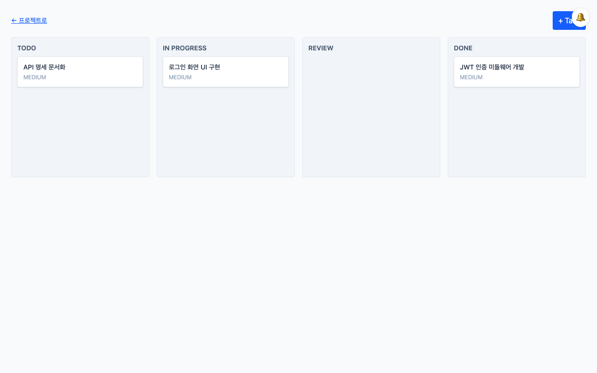

# 안녕하세요, Heesi-ong입니다 👋

## 🚀 TeamFlow — 웹 기반 팀 프로젝트 협업 플랫폼

Task 관리, 실시간 알림/채팅, 문서·파일 관리, 진행률 통계를 하나의 서비스로 통합한 개인 포트폴리오 프로젝트입니다. 단순 CRUD를 넘어 실무에서 요구되는 인증/인가(JWT+RBAC), 실시간 통신(SSE/WebSocket), Redis 캐싱, S3 Presigned URL 파일 업로드, 테스트 자동화(Unit/Integration/API/E2E), CI/CD, 모니터링(Prometheus/Grafana)까지 통합적으로 다뤘습니다.

**🔗 배포**: https://teamflow-frontend-qpod.onrender.com
**📦 저장소**: https://github.com/Heesi-ong/teamflow

**Tech Stack**: React · TypeScript · Vite · Spring Boot · PostgreSQL · Redis · WebSocket/STOMP · SSE · AWS S3 · Docker · GitHub Actions
